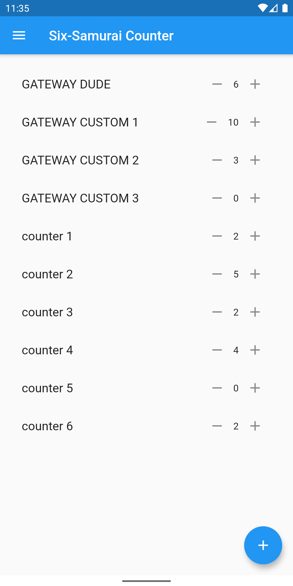
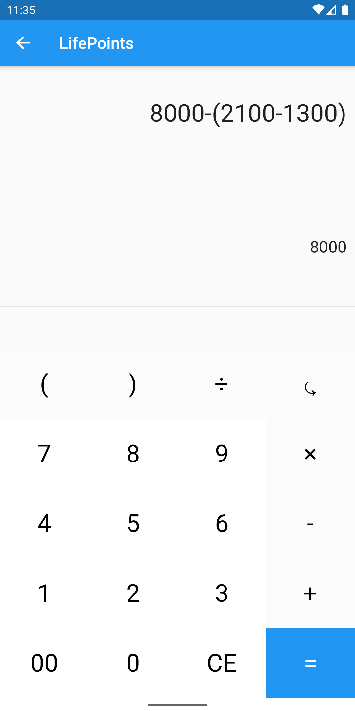

# Six-Samurai Counter

A multi-use app for Yu-Gi-Oh players, especially for the six samurai player
 

## What it is

Six-Samurai Counter initially was an app to help all Yu-Gi-Oh players who use decks that need counters.  
Now is a complete multi-use app for all Yu-Gi-Oh players.

## Download
Get the app from [releases page](https://github.com/Ggwppino/SixSamuraiCounter/releases).

## Usage

 Counters List: Keep all the counts of your cards

  <ul>
  <li>Press "+" button: add a counter</li>
  <li>Long Press "+" button: add a Gateway Counter (increment count 2 by 2)</li></ul>

 Life Points calculator: you can keep track of your and your opponent's LP

 <ul><li>Long press "CE" button: reset select lifpoints player</li>
 <li>Press "⤿" button: reset all lifepoints</li></ul>

- Roll Dice: Roll the dice and hope to start first!
- Coin Toss: You like living on the edge huh?

## License

This software is licensed under terms of the GPLv3. You can find a copy of the license in the [LICENSE.txt](https://github.com/Ggwppino/SixSamuraiCounter/blob/master/LICENSE.txt) file.
